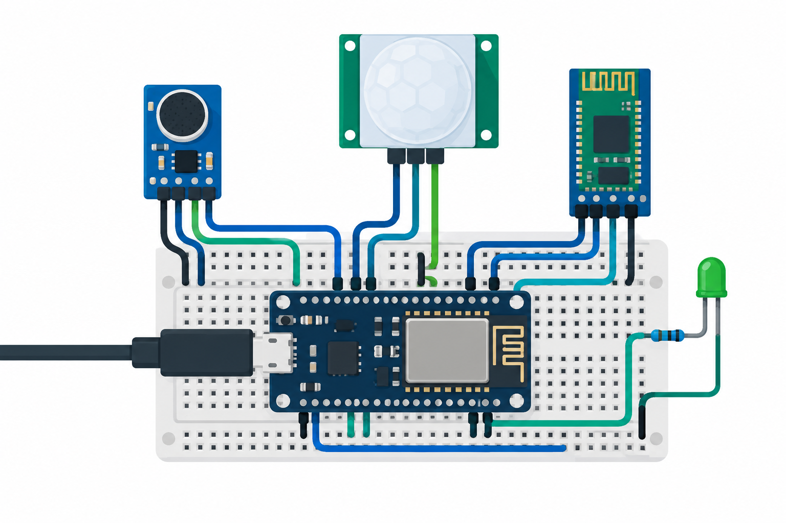

# Room Climate Hub Safety Interlock
An educational ESP8266 permission latch using a microphone and PIR. Motion, loud sound or invalid ADC readings stop an armed demonstration LED automatically. A raw HM-10 provides BLE serial because ESP8266 has no native BLE.



## Objectives and features
Learn fail-off startup, latched trip handling, explicit rearming, real sensor wiring and bounded BLE commands. Permission never arms automatically. The output is only an LED; this prototype is not a protective machine controller.

## Architecture and platform
NodeMCU v2 ESP8266 with onboard A0 divider, Arduino framework and external raw HM-10. Sample every 100ms; take 64 ADC readings and trip on peak-to-peak ≥180 counts. Rail-clipped values (<2 or >1021) are invalid. PIR HIGH trips. Warm-up is 60s after boot, followed by three continuously safe seconds before ARM. Trips remain latched until successful ARM; reboot disables output. [Architecture](docs/architecture.md).

## BOM quantities
| Quantity | Item |
|---|---|
| 1 | NodeMCU v2 with board A0 input rated 3.3V |
| 1 | Analog electret microphone module, 3.3V supply/output |
| 1 | HC-SR501 PIR, 5V supply and 3.3V output |
| 1 | Raw HM-10, 3.3V supply and UART logic |
| 1 each | Green LED and 330Ω resistor |
| 1 each | Breadboard, regulated USB 5V supply/cable |
| 12 | Jumper wires |

## Prerequisites
Python 3.12, PlatformIO 6.1.18, C++17 compiler for host tests, USB serial driver and BLE central app capable of writing FFE1 bytes. Confirm module authenticity and current requirements. NodeMCU USB regulator must support mic plus HM-10. Use only the stated low voltage parts.

## Exact pin map and circuit/wiring
| Controller pin | Connection |
|---|---|
| A0 | Analog mic OUT (0–3.3V board input) |
| D5 / GPIO14 | PIR OUT |
| D6 / GPIO12 RX | HM-10 TXD |
| D7 / GPIO13 TX | HM-10 RXD |
| D2 / GPIO4 OUT | 330Ω resistor → LED anode |
| 3V3 | Mic VCC, raw HM-10 VCC |
| USB 5V supply | PIR VCC and NodeMCU USB |
| GND | Every module GND, LED cathode |
[Editable circuit SVG](docs/circuit-diagram.svg) and [assembly wiring](docs/wiring.md) are authoritative. Illustration is explanatory, not a netlist.

## Assembly
Unplug power. Join grounds, add supply rails, cross UART TX/RX and connect sensor outputs. Add LED resistor. Check rail polarities and mic output rating before power. A bare ESP8266's 1V ADC cannot substitute for NodeMCU's divided input. Warm up PIR and set minimum delay appropriate to the demonstration.

## Setup and flashing
```sh
python -m pip install platformio==6.1.18
pio run -e nodemcuv2
pio run -e nodemcuv2 -t upload
pio device monitor -b 115200
```
Select the USB port via PlatformIO if discovery finds several. USB upload is a user hardware step; CI only compiles.

## Configuration and usage
Constants in firmware are 60s warm-up, 3s safe interval, 180-count sound threshold, 100ms samples and 9600 UART. Calibrate sound threshold using reported sound_pp; ambient noise changes behavior. Use HM-10 BLE service FFE0/characteristic FFE1. Write ASCII `ARM\n` or `STOP\n`. Use actual LF byte, not literal backslash-n. ARM only succeeds after warm-up and stable safe input. STOP clears permission immediately in software; the LED updates on the next sampling pass. Actual output latency has not been measured. Commands >15 characters are discarded/reset; unsupported commands have no effect. HM-10 is an unauthenticated educational link: restrict access and never attach a hazardous load.

## Telemetry/data formats and expected output
USB and BLE emit newline JSON each second: id, warm, motion, sound_pp, valid, armed, latched. [Sample](sample-data/telemetry.jsonl). A quiet safe ARM yields armed true and LED on; motion yields armed false, latched true. BLE notifications may fragment lines: concatenate bytes until LF. No recorded speech, cloud credentials or stored audio.

## Actual run test results
[Validation results](docs/validation-results.md) records observed cloud results. Physical hardware and BLE testing are not performed.
```sh
g++ -std=c++17 tests/interlock_test.cpp -o /tmp/interlock
/tmp/interlock
python -m unittest discover -s tests
python tools/validate.py
python tools/validate_completion.py
pio run -e nodemcuv2
```

## Troubleshooting
ARM refused: wait warm-up and three safe seconds, check PIR retrigger and clipping. Constant sound trips: inspect analog module, power noise and threshold. BLE absent: ESP8266 is not BLE-capable; verify HM-10 service/baud and crossed UART. No LED: check polarity/resistor/GPIO4. Never bridge ADC to 5V.

## Limitations and domain safety
No watchdog-certified redundant channels, sensor disconnection diagnosis, self-test, secure BLE, guaranteed response time or persistent audit. Disconnected mic can appear quiet; PIR cannot prove absence or danger. Millis warm-up becomes false after 49-day wrap until 60s elapse, conservatively disabling output. Firmware timing and noise can miss events. LED-only educational demonstration, never emergency stop, alarm, access control or machinery interlock. No mains wiring.

## Future work
Add redundant monitored sensors, authenticated radio, explicit connection supervision, calibration and hardware-in-loop characterization before considering any real deployment.

## Contributing and license
Preserve fail-off and regression coverage; document wiring/threshold changes and run host plus target gates. See [test plan](docs/test-plan.md). Full [MIT license](LICENSE); contributions use MIT.
